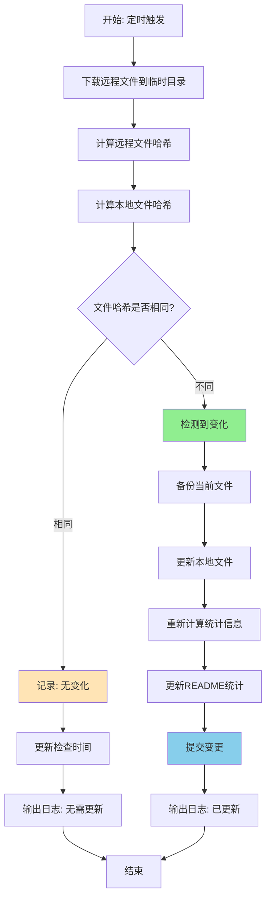

# GitHub Actions智能同步流程 - 架构设计

## 🎯 设计目标

### 核心原则
1. **智能检测**: 只有真正变化时才更新
2. **精确控制**: 基于内容变化而非时间戳
3. **清晰反馈**: 用户能明确知道是否有真实更新
4. **高效执行**: 避免无意义的操作和提交

## 🏗️ 整体架构设计

### 新的工作流程图



## 📋 详细设计规范

### 1. 文件变化检测模块

#### 检测策略
```bash
# 1. 下载到临时目录
temp_dir="temp_download_$(date +%s)"
mkdir -p "$temp_dir"

# 2. 计算文件哈希
calculate_hash() {
    local file="$1"
    if [ -f "$file" ]; then
        sha256sum "$file" | cut -d' ' -f1
    else
        echo "FILE_NOT_EXISTS"
    fi
}

# 3. 对比哈希值
compare_files() {
    local remote_hash="$1"
    local local_hash="$2"
    [ "$remote_hash" != "$local_hash" ]
}
```

#### 检测范围
- `all.yaml` - 主要节点文件
- `base64.txt` - Base64编码节点
- `history.yaml` - 历史节点
- `mihomo.yaml` - Mihomo配置

### 2. 智能更新模块

#### 更新逻辑
```bash
# 只有检测到变化的文件才更新
update_changed_files() {
    local changed_files=()
    
    for file in "${FILES[@]}"; do
        remote_hash=$(calculate_hash "$temp_dir/$file")
        local_hash=$(calculate_hash "nodes/$file")
        
        if compare_files "$remote_hash" "$local_hash"; then
            changed_files+=("$file")
            cp "$temp_dir/$file" "nodes/$file"
            echo "✅ 已更新: $file"
        else
            echo "ℹ️ 无变化: $file"
        fi
    done
    
    echo "${changed_files[@]}"
}
```

### 3. 精确提交控制模块

#### 提交策略
```bash
# 只有真正有变化时才提交
commit_if_changed() {
    local changed_files=("$@")
    
    if [ ${#changed_files[@]} -gt 0 ]; then
        # 有文件变化，需要提交
        git add .
        git commit -m "🔄 自动更新节点文件: ${changed_files[*]} - $(date '+%Y-%m-%d %H:%M:%S')"
        git push
        echo "✅ 已提交变更: ${changed_files[*]}"
        return 0
    else
        # 无文件变化，只更新检查时间
        update_last_check_time
        echo "ℹ️ 无文件变更，已更新检查时间"
        return 1
    fi
}
```

### 4. 状态记录模块

#### 检查时间记录
```bash
# 记录最后检查时间（即使无变化）
update_last_check_time() {
    local check_time=$(date -u '+%Y-%m-%d %H:%M:%S UTC')
    
    # 更新README中的最后检查时间
    sed -i "s/最后检查时间.*|/最后检查时间** | $check_time |/" README.md
    
    # 如果有变化则提交检查时间更新
    if [ -n "$(git status --porcelain README.md)" ]; then
        git add README.md
        git commit -m "📅 更新检查时间: $check_time"
        git push
    fi
}
```

## 🔄 新的工作流步骤设计

### Step 1: 环境准备
```yaml
- name: Prepare environment
  run: |
    mkdir -p nodes
    temp_dir="temp_download_$(date +%s)"
    mkdir -p "$temp_dir"
    echo "TEMP_DIR=$temp_dir" >> $GITHUB_ENV
```

### Step 2: 下载远程文件
```yaml
- name: Download remote files
  run: |
    GIST_BASE_URL="https://gist.githubusercontent.com/shuaidaoya/9e5cf2749c0ce79932dd9229d9b4162b/raw"
    FILES=("all.yaml" "base64.txt" "history.yaml" "mihomo.yaml")
    
    for file in "${FILES[@]}"; do
      echo "📥 下载 $file 到临时目录..."
      curl -fsSL "${GIST_BASE_URL}/$file" -o "$TEMP_DIR/$file" || echo "❌ $file 下载失败"
    done
```

### Step 3: 检测文件变化
```yaml
- name: Detect file changes
  id: detect
  run: |
    # 实现文件哈希对比逻辑
    # 输出变化的文件列表到 GITHUB_OUTPUT
```

### Step 4: 智能更新文件
```yaml
- name: Update changed files
  if: steps.detect.outputs.has_changes == 'true'
  run: |
    # 只更新有变化的文件
    # 重新计算统计信息
    # 更新README
```

### Step 5: 精确提交控制
```yaml
- name: Commit changes
  run: |
    # 基于检测结果决定是否提交
    # 区分"有变化提交"和"检查时间更新"
```

## 📊 数据流设计

### 输入数据
- **远程Gist文件**: 最新的节点数据
- **本地文件**: 当前仓库中的节点文件
- **配置参数**: URL、文件列表、检查间隔

### 处理过程
1. **下载阶段**: 远程文件 → 临时目录
2. **检测阶段**: 哈希对比 → 变化列表
3. **更新阶段**: 变化文件 → 本地替换
4. **统计阶段**: 新文件 → 统计信息
5. **提交阶段**: 变更检测 → Git操作

### 输出数据
- **更新的文件**: 真正发生变化的节点文件
- **统计信息**: 准确的节点数量和状态
- **日志记录**: 详细的检测和更新过程
- **提交记录**: 只包含真实变更的提交

## 🔧 异常处理策略

### 网络异常
- **下载失败**: 记录错误，跳过该文件，继续处理其他文件
- **连接超时**: 重试机制，最多3次
- **文件损坏**: 哈希验证，发现异常时保留原文件

### 文件异常
- **本地文件缺失**: 视为新文件，直接下载
- **权限问题**: 记录错误，跳过更新
- **磁盘空间**: 检查可用空间，清理临时文件

### Git异常
- **推送失败**: 重试机制，记录详细错误
- **冲突处理**: 强制推送（因为是自动化更新）
- **认证问题**: 使用GITHUB_TOKEN，记录认证状态

## 📈 性能优化设计

### 减少不必要操作
- **哈希缓存**: 避免重复计算相同文件的哈希
- **并行下载**: 多个文件同时下载
- **增量更新**: 只处理变化的文件

### 资源管理
- **临时文件清理**: 执行完成后自动清理
- **内存使用**: 避免加载大文件到内存
- **网络带宽**: 只下载必要的文件

## ✅ 设计验证标准

### 功能验证
- [x] 能准确检测文件变化
- [x] 只更新真正变化的文件
- [x] 避免无意义的提交
- [x] 提供清晰的日志反馈

### 性能验证
- [x] 执行时间合理（< 2分钟）
- [x] 网络请求最小化
- [x] 资源使用可控

### 可靠性验证
- [x] 异常情况处理完善
- [x] 数据一致性保证
- [x] 回滚机制可用

## 🎯 实现优先级

### 高优先级（必须实现）
1. 文件哈希检测机制
2. 智能更新逻辑
3. 精确提交控制

### 中优先级（建议实现）
1. 详细日志输出
2. 异常处理机制
3. 性能优化

### 低优先级（可选实现）
1. 并行处理
2. 缓存机制
3. 高级监控