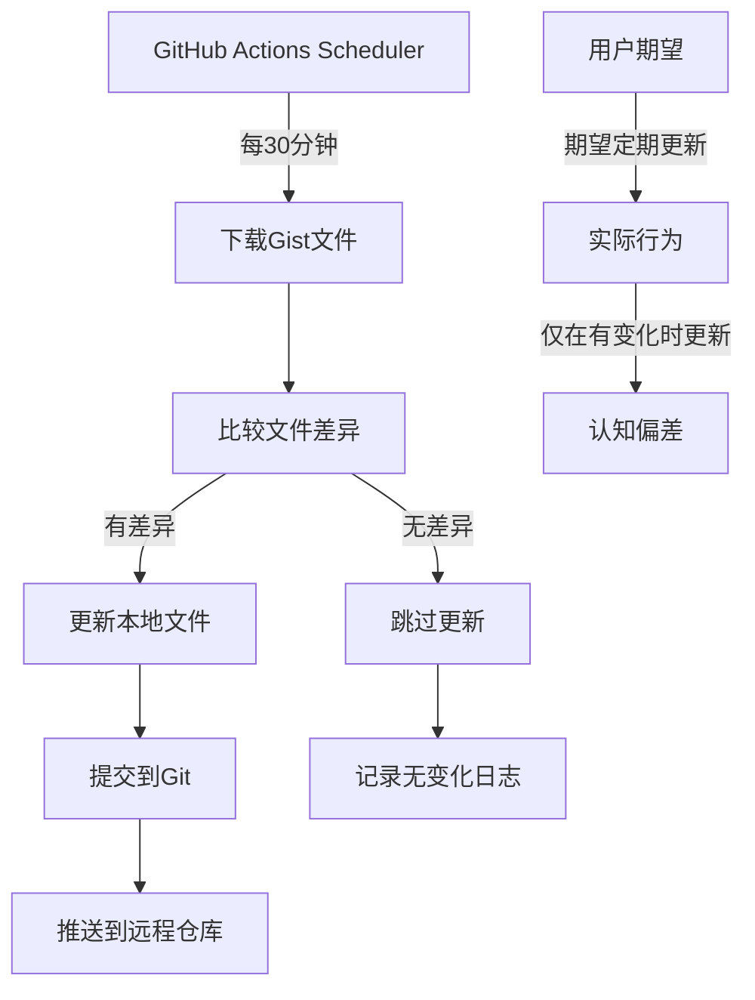
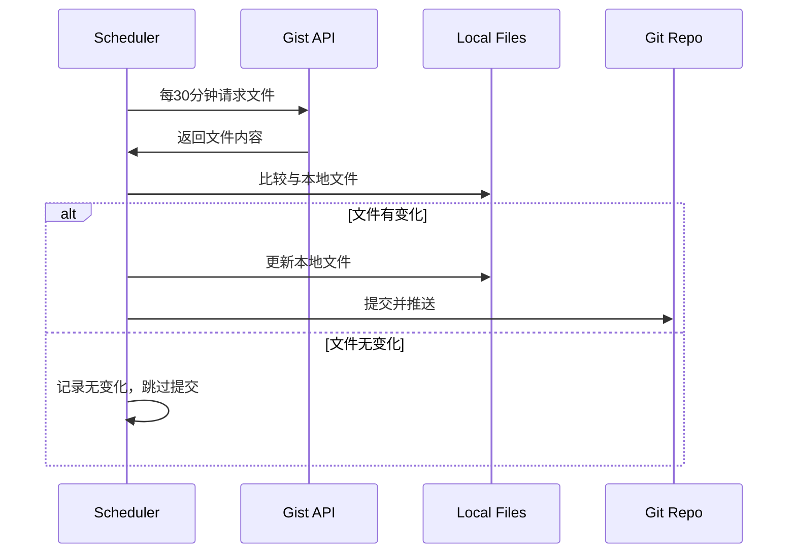

# 节点同步问题架构设计

## 问题根因分析 - 更新

### 真实问题确认
根据用户反馈，发现了真正的问题：

1. **Gist文件已更新**: 用户手动更新了3次（96→102→51个节点）
2. **工作流未同步**: GitHub Actions未检测到Gist文件变化
3. **统计数据过时**: 项目仍显示121个节点（过时数据）
4. **同步机制失效**: 工作流表面运行但未实际更新文件

### 系统架构图



### 数据流向图



## 解决方案设计

### 方案1: 增强监控和日志 (推荐)
- **目标**: 提供更好的透明度，让用户了解系统状态
- **实现**: 
  - 添加详细的运行日志
  - 创建状态页面显示最后检查时间
  - 即使无变化也记录检查活动

### 方案2: 强制定期更新
- **目标**: 即使无变化也定期提交
- **风险**: 产生无意义的提交历史

### 方案3: 改进用户界面
- **目标**: 在README中显示更详细的状态信息
- **实现**: 显示最后检查时间 vs 最后更新时间

## 技术实现方案

### 核心组件设计

1. **状态跟踪组件**
   - 记录最后检查时间
   - 记录最后更新时间
   - 记录检查结果（有变化/无变化）

2. **日志增强组件**
   - GitHub Actions Summary增强
   - README状态区域改进
   - 运行历史记录

3. **用户界面改进**
   - 区分"最后检查"和"最后更新"
   - 显示检查频率状态
   - 提供手动触发选项

### 接口契约定义

```yaml
状态信息接口:
  最后检查时间: ISO8601格式
  最后更新时间: ISO8601格式
  检查状态: "正常" | "异常"
  变化检测: "有变化" | "无变化"
  节点数量: 整数
```

## 异常处理策略

1. **网络异常**: 重试机制，记录失败日志
2. **文件损坏**: 备份恢复机制
3. **权限问题**: 详细错误报告
4. **API限制**: 优雅降级处理

## 验收标准

1. ✅ 用户能清楚看到系统运行状态
2. ✅ 区分检查活动和实际更新
3. ✅ 提供透明的日志信息
4. ✅ 保持现有更新逻辑不变
5. ✅ 不产生无意义的提交