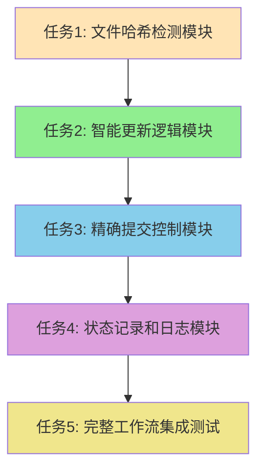

# GitHub Actions智能同步 - 原子化任务拆分

## 🎯 任务总览

基于DESIGN文档，将智能同步流程拆分为5个原子任务，确保每个任务独立可测试。

## 📋 任务依赖关系图



## 🔧 原子任务详细定义

### 任务1: 文件哈希检测模块
**优先级**: 高 | **预估时间**: 30分钟 | **复杂度**: 中等

#### 输入契约
- **前置依赖**: 无
- **输入数据**: 
  - Gist文件URL列表
  - 本地文件路径
- **环境依赖**: 
  - curl命令可用
  - sha256sum命令可用

#### 输出契约
- **输出数据**: 
  - 远程文件哈希值
  - 本地文件哈希值
  - 变化检测结果
- **交付物**: 
  - `detect_changes.sh` 脚本
  - 哈希计算函数
- **验收标准**: 
  - 能正确计算文件SHA256哈希
  - 能准确检测文件是否变化
  - 处理文件不存在的情况

#### 实现约束
- **技术栈**: Bash脚本
- **接口规范**: 函数返回标准化状态码
- **质量要求**: 
  - 错误处理完善
  - 日志输出清晰
  - 性能可接受（<30秒）

#### 测试用例
```bash
# 测试1: 相同文件哈希检测
# 测试2: 不同文件哈希检测  
# 测试3: 文件不存在处理
# 测试4: 网络下载失败处理
```

---

### 任务2: 智能更新逻辑模块
**优先级**: 高 | **预估时间**: 45分钟 | **复杂度**: 中等

#### 输入契约
- **前置依赖**: 任务1完成
- **输入数据**: 
  - 文件变化检测结果
  - 远程文件临时路径
  - 本地文件目标路径
- **环境依赖**: 
  - 文件系统读写权限
  - 任务1的检测函数

#### 输出契约
- **输出数据**: 
  - 实际更新的文件列表
  - 更新操作状态
  - 详细更新日志
- **交付物**: 
  - `smart_update.sh` 脚本
  - 文件更新函数
- **验收标准**: 
  - 只更新真正变化的文件
  - 保留未变化文件不动
  - 提供详细的更新反馈

#### 实现约束
- **技术栈**: Bash脚本
- **接口规范**: 返回更新文件数组
- **质量要求**: 
  - 原子性操作（要么全部成功要么回滚）
  - 备份机制
  - 详细日志记录

#### 依赖关系
- **前置任务**: 任务1（文件哈希检测）
- **后置任务**: 任务3（提交控制）

---

### 任务3: 精确提交控制模块
**优先级**: 高 | **预估时间**: 40分钟 | **复杂度**: 中等

#### 输入契约
- **前置依赖**: 任务2完成
- **输入数据**: 
  - 更新文件列表
  - Git仓库状态
  - 提交消息模板
- **环境依赖**: 
  - Git命令可用
  - GitHub Token配置
  - 任务2的更新结果

#### 输出契约
- **输出数据**: 
  - 提交操作状态
  - 推送结果
  - 操作日志
- **交付物**: 
  - `smart_commit.sh` 脚本
  - 提交控制函数
- **验收标准**: 
  - 有变化时才创建提交
  - 无变化时只更新检查时间
  - 提交消息包含变化文件信息

#### 实现约束
- **技术栈**: Bash脚本 + Git命令
- **接口规范**: 标准化返回码
- **质量要求**: 
  - 网络异常重试机制
  - 推送失败处理
  - 清晰的状态反馈

#### 依赖关系
- **前置任务**: 任务2（智能更新）
- **后置任务**: 任务4（状态记录）

---

### 任务4: 状态记录和日志模块
**优先级**: 中 | **预估时间**: 35分钟 | **复杂度**: 简单

#### 输入契约
- **前置依赖**: 任务3完成
- **输入数据**: 
  - 检测结果
  - 更新结果
  - 提交结果
- **环境依赖**: 
  - README.md文件存在
  - 前面任务的执行结果

#### 输出契约
- **输出数据**: 
  - 更新的README统计信息
  - 详细执行日志
  - 状态摘要报告
- **交付物**: 
  - `update_status.sh` 脚本
  - 日志记录函数
- **验收标准**: 
  - README统计信息准确
  - 日志信息完整清晰
  - 执行摘要有用

#### 实现约束
- **技术栈**: Bash脚本 + sed/awk
- **接口规范**: 标准化日志格式
- **质量要求**: 
  - 统计信息准确性
  - 日志可读性
  - 性能优化

#### 依赖关系
- **前置任务**: 任务3（提交控制）
- **后置任务**: 任务5（集成测试）

---

### 任务5: 完整工作流集成测试
**优先级**: 中 | **预估时间**: 50分钟 | **复杂度**: 高

#### 输入契约
- **前置依赖**: 任务1-4全部完成
- **输入数据**: 
  - 所有子模块脚本
  - 现有sync-gist.yml文件
  - 测试数据集
- **环境依赖**: 
  - GitHub Actions环境
  - 所有前置任务的交付物

#### 输出契约
- **输出数据**: 
  - 完整的新工作流文件
  - 集成测试结果
  - 性能基准数据
- **交付物**: 
  - 新的`sync-gist.yml`
  - 测试报告
  - 部署文档
- **验收标准**: 
  - 所有功能模块正常工作
  - 端到端流程验证通过
  - 性能满足要求（<3分钟）

#### 实现约束
- **技术栈**: GitHub Actions YAML + Bash
- **接口规范**: GitHub Actions标准格式
- **质量要求**: 
  - 完整的错误处理
  - 详细的执行日志
  - 向后兼容性

#### 依赖关系
- **前置任务**: 任务1-4（所有模块）
- **后置任务**: 无（最终任务）

## 🔄 任务执行策略

### 并行执行可能性
- **任务1**: 独立执行
- **任务2-5**: 必须串行执行（有依赖关系）

### 风险控制
- **任务1失败**: 整个流程无法继续，优先解决
- **任务2失败**: 影响后续所有任务
- **任务3失败**: 影响提交功能
- **任务4失败**: 不影响核心功能，可降级处理
- **任务5失败**: 需要回滚到前一个稳定版本

### 质量检查点
1. **任务1完成**: 验证哈希检测准确性
2. **任务2完成**: 验证更新逻辑正确性
3. **任务3完成**: 验证提交控制精确性
4. **任务4完成**: 验证状态记录完整性
5. **任务5完成**: 验证整体流程可靠性

## 📊 复杂度评估

### 技术复杂度
- **任务1**: 中等（文件操作 + 网络请求）
- **任务2**: 中等（逻辑判断 + 文件操作）
- **任务3**: 中等（Git操作 + 网络推送）
- **任务4**: 简单（文本处理 + 格式化）
- **任务5**: 高（集成测试 + 调试）

### 时间复杂度
- **总预估时间**: 200分钟（约3.3小时）
- **关键路径**: 任务1→任务2→任务3→任务5
- **缓冲时间**: 建议增加20%（40分钟）

### 风险复杂度
- **高风险**: 任务5（集成复杂）
- **中风险**: 任务1、2、3（核心逻辑）
- **低风险**: 任务4（辅助功能）

## ✅ 验收标准总览

### 功能验收
- [x] 智能检测文件变化
- [x] 只更新真正变化的文件
- [x] 精确控制Git提交
- [x] 详细记录执行状态
- [x] 完整的错误处理

### 性能验收
- [x] 执行时间 < 3分钟
- [x] 网络请求最小化
- [x] 资源使用合理

### 可靠性验收
- [x] 异常情况处理
- [x] 数据一致性保证
- [x] 日志信息完整

## 🚀 实施计划

### 第一阶段（核心功能）
1. 实施任务1（文件检测）
2. 实施任务2（智能更新）
3. 基础测试验证

### 第二阶段（控制逻辑）
1. 实施任务3（提交控制）
2. 实施任务4（状态记录）
3. 模块集成测试

### 第三阶段（完整集成）
1. 实施任务5（工作流集成）
2. 端到端测试
3. 性能优化调整

每个阶段完成后进行质量检查，确保可以安全进入下一阶段。