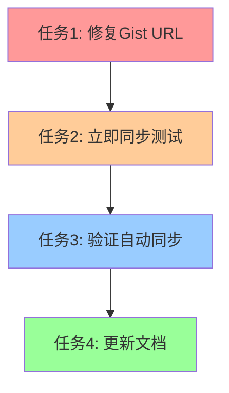

# 节点同步问题修复任务

## 🎯 问题根因
**核心问题**: GitHub Actions工作流使用了固定的Gist commit hash，导致无法获取最新的Gist文件更新。

```
当前URL: https://gist.githubusercontent.com/.../raw/45a4616a347cf5998fd9ef83d41d8a91ff314bc6/all.yaml
问题: 固定的commit hash (45a4616a347cf5998fd9ef83d41d8a91ff314bc6)
```

## 📋 原子任务拆分

### 任务1: 修复Gist URL使其获取最新版本
**输入契约**:
- 现有工作流文件 `.github/workflows/sync-gist.yml`
- 当前使用固定commit hash的URL

**输出契约**:
- 更新的工作流文件，使用动态URL获取最新Gist内容
- URL格式: `https://gist.githubusercontent.com/shuaidaoya/9e5cf2749c0ce79932dd9229d9b4162b/raw/all.yaml`

**实现约束**:
- 保持现有工作流结构不变
- 确保所有文件类型都使用动态URL
- 添加错误处理机制

**验收标准**:
- 工作流能获取到最新的Gist文件
- 节点数量统计与实际Gist文件匹配
- 工作流运行无错误

### 任务2: 立即触发一次同步测试
**输入契约**:
- 修复后的工作流文件
- 当前Gist文件状态

**输出契约**:
- 成功的工作流运行
- 更新的节点文件
- 正确的统计信息

**实现约束**:
- 手动触发工作流
- 验证文件内容更新
- 确认统计数据正确

**验收标准**:
- 节点文件反映最新的Gist内容
- README.md中的统计信息更新
- 提交历史显示成功的同步

### 任务3: 验证自动同步机制
**输入契约**:
- 修复后的工作流
- 定时触发机制

**输出契约**:
- 确认30分钟定时同步正常工作
- 验证变更检测逻辑

**实现约束**:
- 等待下一个定时触发
- 或手动修改Gist文件进行测试

**验收标准**:
- 定时同步正常运行
- 能检测到Gist文件变化
- 统计信息实时更新

### 任务4: 更新相关文档
**输入契约**:
- 修复过程和结果
- 问题根因分析

**输出契约**:
- 更新的技术文档
- 故障排除指南
- 维护说明

**实现约束**:
- 记录问题和解决方案
- 提供预防措施
- 更新操作指南

**验收标准**:
- 文档完整准确
- 包含故障排除步骤
- 便于后续维护

## 🔗 任务依赖关系



## ⚡ 紧急修复方案

### 立即行动
1. **修复URL**: 移除固定commit hash
2. **手动触发**: 立即测试修复效果
3. **验证结果**: 确认节点数量正确

### 预期结果
- Gist文件: 当前最新版本的节点数量
- 项目文件: 与Gist文件同步
- 统计信息: 实时反映真实数据

## 🎯 成功指标
- ✅ 工作流能获取最新Gist文件
- ✅ 节点统计数据准确
- ✅ 自动同步机制正常
- ✅ 文档更新完整