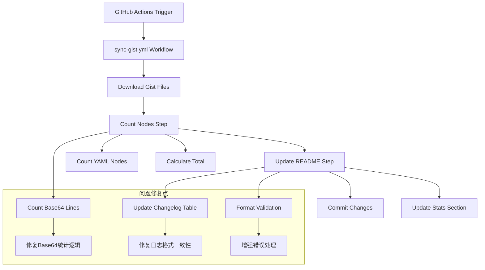
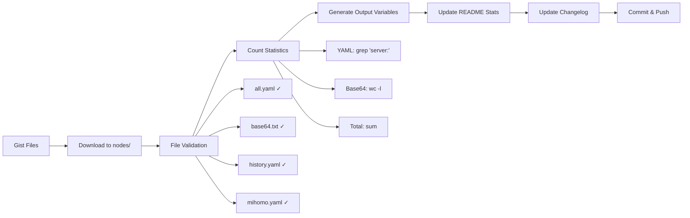

# README.md 统计功能修复架构设计

## 🏗️ 整体架构图



## 🔧 核心组件设计

### 1. 节点统计模块 (Count Nodes)

#### 当前问题
- Base64文件统计返回0行
- 统计逻辑可能存在文件路径问题

#### 修复方案
```bash
# 改进的统计逻辑
if [ -f "nodes/base64.txt" ]; then
  # 确保文件存在且不为空
  if [ -s "nodes/base64.txt" ]; then
    base64_lines=$(wc -l < nodes/base64.txt 2>/dev/null | tr -d ' ')
    # 验证结果是否为数字
    if ! [[ "$base64_lines" =~ ^[0-9]+$ ]]; then
      base64_lines=0
    fi
  else
    base64_lines=0
  fi
  echo "base64_lines=$base64_lines" >> $GITHUB_OUTPUT
else
  base64_lines=0
  echo "base64_lines=0" >> $GITHUB_OUTPUT
fi
```

### 2. README更新模块 (Update README)

#### 当前问题
- 更新日志表格格式不一致
- 历史记录存在格式错误

#### 修复方案

##### 2.1 实时统计区域更新
```bash
# 使用更可靠的sed替换逻辑
sed -i '/<!-- AUTO_STATS_START -->/,/<!-- AUTO_STATS_END -->/{
  /| 🕐 \*\*最后更新时间\*\*/ s/| [^|]* |$/| '"$current_utc"' |/
  /| 🌐 \*\*节点总数\*\*/ s/| [^|]* |$/| '"$total_nodes"' 个 |/
  /| 📄 \*\*YAML 节点\*\*/ s/| [^|]* |$/| '"$yaml_nodes"' 个 |/
  /| 📝 \*\*Base64 行数\*\*/ s/| [^|]* |$/| '"$base64_lines"' 行 |/
  /| 🔄 \*\*同步状态\*\*/ s/| [^|]* |$/| 🟢 已同步 |/
}' README.md
```

##### 2.2 更新日志表格处理
```bash
# 标准化日期时间格式
current_datetime=$(date '+%Y-%m-%d %H:%M:%S')
today_date=$(date '+%Y-%m-%d')

# 生成标准化的节点详情
if [ "$yaml_nodes" -gt 0 ] && [ "$base64_lines" -gt 0 ]; then
  node_details="📊 自动更新 - YAML:${yaml_nodes}个 Base64:${base64_lines}行"
elif [ "$yaml_nodes" -gt 0 ]; then
  node_details="📊 自动更新 - YAML节点:${yaml_nodes}个"
elif [ "$base64_lines" -gt 0 ]; then
  node_details="📊 自动更新 - Base64:${base64_lines}行"
else
  node_details="📊 自动更新"
fi

# 检查并更新今日记录
if grep -q "| $today_date.*📊 自动更新" README.md; then
  # 更新现有记录
  sed -i "s/| $today_date [0-9:]*.*| [^|]*个节点 | .*📊 自动更新.*/| $current_datetime | ${total_nodes}个节点 | $node_details |/" README.md
else
  # 添加新记录
  sed -i '/|------|------|----------|/a\| '"$current_datetime"' | '"$total_nodes"'个节点 | '"$node_details"' |' README.md
fi
```

### 3. 错误处理和验证模块

#### 设计原则
- 每个关键步骤都有错误检查
- 提供详细的日志输出
- 确保部分失败不影响整体流程

#### 实现方案
```bash
# 文件验证函数
validate_file() {
  local file_path="$1"
  local file_type="$2"
  
  if [ ! -f "$file_path" ]; then
    echo "⚠️ 警告: $file_type 文件不存在: $file_path"
    return 1
  fi
  
  if [ ! -s "$file_path" ]; then
    echo "⚠️ 警告: $file_type 文件为空: $file_path"
    return 1
  fi
  
  echo "✅ $file_type 文件验证通过: $file_path"
  return 0
}

# 统计验证函数
validate_count() {
  local count="$1"
  local type="$2"
  
  if ! [[ "$count" =~ ^[0-9]+$ ]]; then
    echo "⚠️ 警告: $type 统计结果无效: $count，设置为0"
    echo "0"
  else
    echo "$count"
  fi
}
```

## 📊 数据流向图



## 🔄 异常处理策略

### 1. 文件下载失败
- **策略**: 继续处理已下载的文件
- **日志**: 记录失败的文件名
- **影响**: 统计可能不完整，但不中断流程

### 2. 统计计算错误
- **策略**: 设置默认值为0
- **日志**: 记录错误详情
- **影响**: 显示保守的统计结果

### 3. README更新失败
- **策略**: 记录错误但继续提交其他更改
- **日志**: 详细错误信息
- **影响**: 统计可能不更新，但文件同步正常

## 🎯 接口契约定义

### GitHub Actions输出变量
```yaml
outputs:
  total_nodes: 
    description: "总节点数量"
    type: "number"
  yaml_nodes:
    description: "YAML格式节点数量" 
    type: "number"
  base64_lines:
    description: "Base64文件行数"
    type: "number"
```

### README.md格式规范
```markdown
<!-- AUTO_STATS_START -->
## 📊 实时统计
| 项目 | 状态 |
|------|------|
| 🕐 **最后更新时间** | YYYY-MM-DD HH:MM:SS UTC |
| 🌐 **节点总数** | {total_nodes} 个 |
| 📄 **YAML 节点** | {yaml_nodes} 个 |
| 📝 **Base64 行数** | {base64_lines} 行 |
| 🔄 **同步状态** | 🟢 已同步 |
<!-- AUTO_STATS_END -->

## 📋 更新日志
| 日期 | 节点数量 | 节点详情 |
|------|------|----------|
| YYYY-MM-DD HH:MM:SS | {total_nodes}个节点 | 📊 自动更新 - 详情描述 |
```

## ✅ 设计验证

### 架构一致性
- ✅ 与现有GitHub Actions工作流兼容
- ✅ 保持现有文件结构和命名
- ✅ 不影响节点文件同步功能

### 可行性验证
- ✅ 所有修复都在现有工作流框架内
- ✅ 使用标准bash命令和工具
- ✅ 错误处理机制完善

### 性能影响
- ✅ 不增加额外的网络请求
- ✅ 计算复杂度保持线性
- ✅ 文件操作优化高效