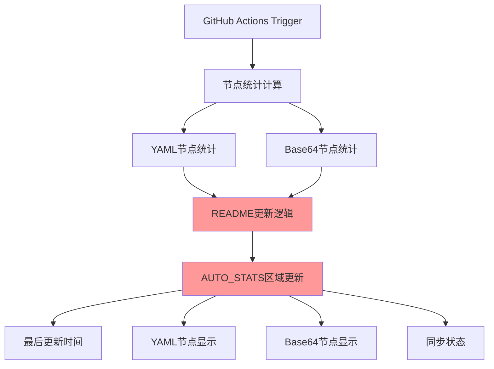
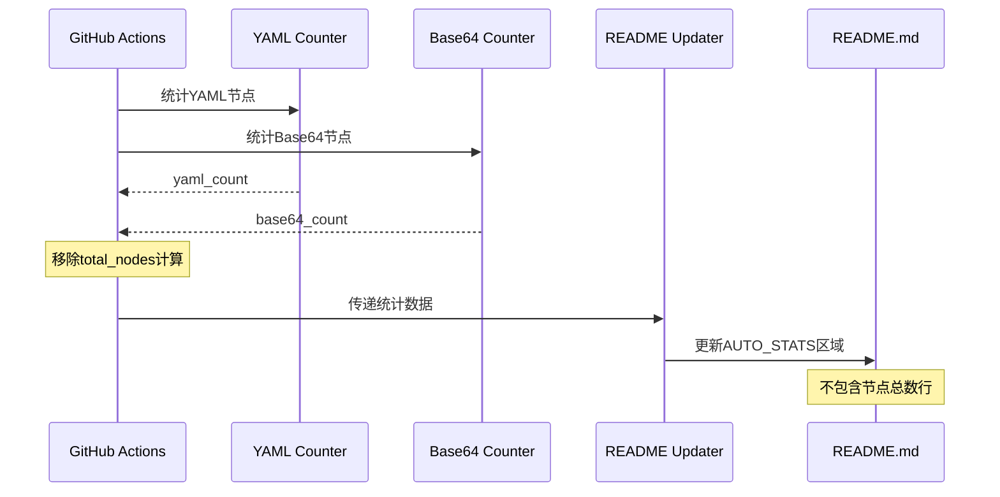

# 统计显示优化 - 设计文档

## 🏗️ 整体架构图



## 🔧 核心组件设计

### 1. 统计计算模块 (保持不变)
```yaml
功能: 计算YAML和Base64节点数量
输入: nodes/all.yaml, nodes/base64.txt
输出: yaml_count, base64_count
状态: 无需修改
```

### 2. README更新模块 (需要修改)
```yaml
功能: 更新AUTO_STATS区域
输入: yaml_count, base64_count, 更新时间, 同步状态
输出: 格式化的统计表格
修改: 移除total_nodes相关逻辑
```

## 📊 修改前后对比

### 修改前的显示格式
```markdown
| 🕐 **最后更新时间** | 2025-10-11 01:23:53 UTC |
| 🌐 **节点总数** | 119 个 |
| 📄 **YAML 节点** | 60 个 |
| 📝 **Base64 节点数** | 59 个 |
| 🔄 **同步状态** | 🟢 已同步 |
```

### 修改后的显示格式
```markdown
| 🕐 **最后更新时间** | 2025-10-11 01:23:53 UTC |
| 📄 **YAML 节点** | 60 个 |
| 📝 **Base64 节点数** | 59 个 |
| 🔄 **同步状态** | 🟢 已同步 |
```

## 🔄 数据流向图



## 🛠️ 接口契约定义

### README更新接口
```powershell
# 输入参数
$yaml_count: int        # YAML节点数量
$base64_count: int      # Base64节点数量
$update_time: string    # 更新时间
$sync_status: string    # 同步状态

# 输出格式
AUTO_STATS_TABLE = """
| 🕐 **最后更新时间** | $update_time |
| 📄 **YAML 节点** | $yaml_count 个 |
| 📝 **Base64 节点数** | $base64_count 个 |
| 🔄 **同步状态** | $sync_status |
"""
```

## 🔧 具体实现方案

### 1. 修改GitHub Actions工作流
**文件**: `.github/workflows/sync-gist.yml`

**修改点1**: 移除total_nodes计算
```powershell
# 删除这行
$total_nodes = $yaml_count + $base64_count
```

**修改点2**: 更新README格式化逻辑
```powershell
# 修改AUTO_STATS区域更新逻辑
$auto_stats = @"
<!-- AUTO_STATS_START -->
| 🕐 **最后更新时间** | $update_time |
| 📄 **YAML 节点** | $yaml_count 个 |
| 📝 **Base64 节点数** | $base64_count 个 |
| 🔄 **同步状态** | 🟢 已同步 |
<!-- AUTO_STATS_END -->
"@
```

### 2. 保持现有功能
- ✅ 错误处理机制
- ✅ 备份恢复功能
- ✅ 数据验证逻辑
- ✅ 更新日志格式

## 🧪 异常处理策略

### 1. 统计失败处理
```powershell
if (-not $yaml_count -or -not $base64_count) {
    Write-Host "统计失败，使用备份数据"
    # 恢复逻辑保持不变
}
```

### 2. README更新失败处理
```powershell
try {
    # README更新逻辑
} catch {
    Write-Host "README更新失败: $_"
    # 恢复机制保持不变
}
```

## ✅ 设计验证

### 1. 架构一致性
- ✅ 与现有系统架构对齐
- ✅ 保持模块化设计
- ✅ 不破坏现有接口

### 2. 功能完整性
- ✅ 统计功能保持完整
- ✅ 显示格式符合需求
- ✅ 错误处理机制完善

### 3. 可维护性
- ✅ 代码修改最小化
- ✅ 逻辑清晰易懂
- ✅ 便于后续扩展

## 🎯 设计质量门控通过
- ✅ 架构图清晰准确
- ✅ 接口定义完整
- ✅ 与现有系统无冲突
- ✅ 设计可行性已验证