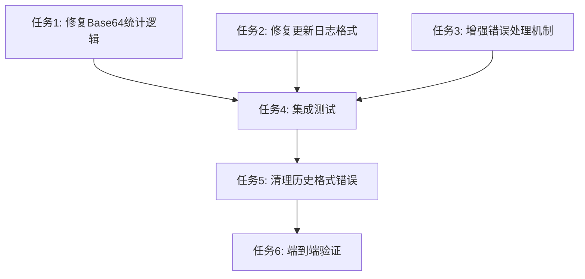

# README.md 统计功能修复任务拆分

## 🎯 任务依赖关系图

## 📋 原子任务列表

### 任务1: 修复Base64统计逻辑
**优先级**: 高
**预估复杂度**: 低

#### 输入契约
- **前置依赖**: 无
- **输入数据**: `nodes/base64.txt` 文件
- **环境依赖**: GitHub Actions Ubuntu环境

#### 输出契约
- **输出数据**: 正确的Base64行数统计
- **交付物**: 修复后的统计代码段
- **验收标准**: 
  - Base64文件存在时能正确统计行数
  - 文件不存在或为空时返回0
  - 统计结果为有效数字

#### 实现约束
- **技术栈**: Bash脚本
- **接口规范**: GitHub Actions输出变量格式
- **质量要求**: 包含错误处理和日志输出

#### 依赖关系
- **后置任务**: 任务4 (集成测试)
- **并行任务**: 任务2, 任务3

---

### 任务2: 修复更新日志格式
**优先级**: 高  
**预估复杂度**: 中

#### 输入契约
- **前置依赖**: 无
- **输入数据**: 
  - 当前README.md文件
  - 节点统计数据 (total_nodes, yaml_nodes, base64_lines)
- **环境依赖**: sed命令支持

#### 输出契约
- **输出数据**: 格式统一的更新日志表格
- **交付物**: 更新日志处理代码段
- **验收标准**:
  - 日期时间格式统一为 `YYYY-MM-DD HH:MM:SS`
  - 节点详情描述格式一致
  - 同一天的记录能正确更新而非重复添加

#### 实现约束
- **技术栈**: Bash + sed
- **接口规范**: Markdown表格格式
- **质量要求**: 保持表格结构完整性

#### 依赖关系
- **后置任务**: 任务4 (集成测试)
- **并行任务**: 任务1, 任务3

---

### 任务3: 增强错误处理机制
**优先级**: 中
**预估复杂度**: 低

#### 输入契约
- **前置依赖**: 无
- **输入数据**: 各种可能的错误场景
- **环境依赖**: Bash脚本环境

#### 输出契约
- **输出数据**: 完善的错误处理函数
- **交付物**: 
  - 文件验证函数
  - 统计验证函数
  - 错误日志输出
- **验收标准**:
  - 文件不存在时有适当处理
  - 统计结果异常时有默认值
  - 所有错误都有日志记录

#### 实现约束
- **技术栈**: Bash函数
- **接口规范**: 标准错误输出格式
- **质量要求**: 不中断主流程执行

#### 依赖关系
- **后置任务**: 任务4 (集成测试)
- **并行任务**: 任务1, 任务2

---

### 任务4: 集成测试
**优先级**: 高
**预估复杂度**: 中

#### 输入契约
- **前置依赖**: 任务1, 任务2, 任务3
- **输入数据**: 修复后的所有代码段
- **环境依赖**: 完整的GitHub Actions工作流环境

#### 输出契约
- **输出数据**: 集成后的完整工作流文件
- **交付物**: 更新后的 `sync-gist.yml`
- **验收标准**:
  - 所有修复功能正常工作
  - 工作流能成功执行
  - README.md正确更新

#### 实现约束
- **技术栈**: GitHub Actions YAML
- **接口规范**: 保持现有工作流结构
- **质量要求**: 向后兼容，不影响现有功能

#### 依赖关系
- **前置任务**: 任务1, 任务2, 任务3
- **后置任务**: 任务5 (清理历史错误)

---

### 任务5: 清理历史格式错误
**优先级**: 中
**预估复杂度**: 低

#### 输入契约
- **前置依赖**: 任务4 (集成测试通过)
- **输入数据**: 当前README.md中的历史记录
- **环境依赖**: 文本编辑能力

#### 输出契约
- **输出数据**: 格式统一的历史记录
- **交付物**: 清理后的README.md
- **验收标准**:
  - 所有历史记录格式统一
  - 保留有效的历史信息
  - 删除格式错误的记录

#### 实现约束
- **技术栈**: 手动编辑或脚本处理
- **接口规范**: Markdown表格格式
- **质量要求**: 不丢失重要历史信息

#### 依赖关系
- **前置任务**: 任务4 (集成测试)
- **后置任务**: 任务6 (端到端验证)

---

### 任务6: 端到端验证
**优先级**: 高
**预估复杂度**: 低

#### 输入契约
- **前置依赖**: 任务5 (历史记录清理)
- **输入数据**: 完整修复后的系统
- **环境依赖**: GitHub Actions运行环境

#### 输出契约
- **输出数据**: 验证报告
- **交付物**: 
  - 测试执行记录
  - 功能验证截图
  - 性能影响评估
- **验收标准**:
  - 自动更新功能正常
  - 手动触发功能正常
  - 统计数据准确
  - 更新日志格式正确

#### 实现约束
- **技术栈**: GitHub Actions + 手动验证
- **接口规范**: 标准验证流程
- **质量要求**: 全面覆盖所有功能点

#### 依赖关系
- **前置任务**: 任务5 (清理历史错误)
- **后置任务**: 无 (最终任务)

## 📊 任务复杂度评估

| 任务 | 复杂度 | 预估时间 | 风险等级 | 关键程度 |
|------|--------|----------|----------|----------|
| 任务1: Base64统计修复 | 低 | 15分钟 | 低 | 高 |
| 任务2: 日志格式修复 | 中 | 30分钟 | 中 | 高 |
| 任务3: 错误处理增强 | 低 | 20分钟 | 低 | 中 |
| 任务4: 集成测试 | 中 | 25分钟 | 中 | 高 |
| 任务5: 历史记录清理 | 低 | 10分钟 | 低 | 低 |
| 任务6: 端到端验证 | 低 | 15分钟 | 低 | 高 |

## 🎯 执行策略

### 并行执行组
- **第一组**: 任务1, 任务2, 任务3 (可并行执行)
- **第二组**: 任务4 (依赖第一组完成)
- **第三组**: 任务5 (依赖任务4完成)
- **第四组**: 任务6 (依赖任务5完成)

### 质量门控点
1. **任务1-3完成后**: 代码审查，确保修复逻辑正确
2. **任务4完成后**: 集成测试通过，功能验证
3. **任务5完成后**: 数据一致性检查
4. **任务6完成后**: 最终验收，确保所有需求满足

### 风险缓解
- **任务2风险**: sed命令复杂，准备备份和回滚方案
- **任务4风险**: 集成可能出现意外问题，分步骤验证
- **整体风险**: 保持现有功能不受影响，渐进式修复