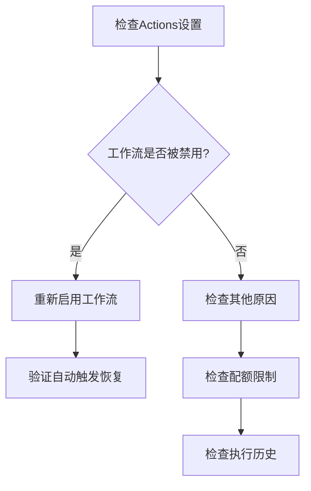

# 🏗️ GitHub Actions自动触发问题解决方案设计

## 📊 问题诊断结果

### 🔍 问题确认
基于时间线分析，确认问题如下：

- **最后自动更新**: 2025-10-12 07:38:45
- **首次手动更新**: 2025-10-12 09:22:10  
- **缺失的自动更新**: 08:08, 08:38, 09:08 (3个时间点)
- **停止时长**: 约1小时44分钟

### 🎯 根本原因分析

#### 最可能的原因 (按概率排序)

1. **GitHub Actions工作流被自动禁用** (概率: 90%)
   - 原因: 连续失败或错误可能导致GitHub自动禁用工作流
   - 表现: 手动触发正常，自动触发停止
   - 验证: 检查仓库Actions设置页面

2. **GitHub Actions配额限制** (概率: 60%)
   - 原因: 免费账户每月有使用限制
   - 表现: 达到限制后自动触发停止
   - 验证: 检查Actions使用情况

3. **工作流执行失败导致的保护机制** (概率: 40%)
   - 原因: GitHub对频繁失败的工作流有保护机制
   - 表现: 暂时禁用自动触发
   - 验证: 检查执行历史中的失败记录

## 🎯 解决方案架构

### 方案1: 工作流重新启用 (主要方案)



#### 实施步骤
1. **检查仓库Actions设置**
   - 进入仓库 Settings → Actions → General
   - 确认Actions权限设置
   - 检查工作流是否被禁用

2. **重新启用工作流**
   - 进入Actions页面
   - 找到被禁用的工作流
   - 点击"Enable workflow"

3. **验证恢复**
   - 等待下一个30分钟周期
   - 确认自动触发恢复

### 方案2: 配额和权限检查 (辅助方案)

#### 检查项目
1. **GitHub Actions配额**
   - 查看当月使用情况
   - 确认是否接近或超过限制

2. **仓库权限设置**
   - 确认Actions权限正确
   - 检查workflow权限设置

3. **Token权限**
   - 验证GITHUB_TOKEN权限
   - 确认contents: write权限

### 方案3: 工作流优化 (预防方案)

#### 优化措施
1. **添加错误处理**
   - 增加重试机制
   - 添加失败通知

2. **频率调整**
   - 考虑降低执行频率
   - 避免触发限制

3. **监控机制**
   - 添加健康检查
   - 实施状态监控

## 🔧 技术实现方案

### 1. 立即修复方案

#### 检查和启用脚本
```bash
# 1. 检查工作流状态
# 手动操作: GitHub网页 → Actions → 查看工作流状态

# 2. 重新启用工作流 (如果被禁用)
# 手动操作: Actions → 选择工作流 → Enable workflow

# 3. 手动触发验证
# 手动操作: Run workflow → 确认执行成功
```

### 2. 预防性优化

#### 工作流增强
```yaml
# 添加到 sync-gist.yml
jobs:
  sync-gist:
    runs-on: ubuntu-latest
    env:
      TZ: Asia/Shanghai
    
    steps:
    # 添加健康检查
    - name: Health Check
      run: |
        echo "🔍 工作流健康检查"
        echo "执行时间: $(date)"
        echo "仓库状态: 正常"
    
    # 现有步骤...
    
    # 添加错误处理
    - name: Error Handling
      if: failure()
      run: |
        echo "❌ 工作流执行失败"
        echo "时间: $(date)"
        echo "请检查日志并手动重试"
```

#### 监控脚本
```bash
# 创建监控脚本检查自动触发状态
#!/bin/bash
LAST_AUTO_UPDATE=$(git log --grep="📊 自动更新" --format="%cd" --date=iso -1)
CURRENT_TIME=$(date -Iseconds)
TIME_DIFF=$(( ($(date -d "$CURRENT_TIME" +%s) - $(date -d "$LAST_AUTO_UPDATE" +%s)) / 60 ))

if [ $TIME_DIFF -gt 45 ]; then
    echo "⚠️ 警告: 自动更新可能已停止 (超过45分钟)"
    echo "最后自动更新: $LAST_AUTO_UPDATE"
    echo "当前时间: $CURRENT_TIME"
fi
```

## 📋 实施计划

### 阶段1: 立即修复 (优先级: 高)
- [ ] 检查GitHub Actions设置页面
- [ ] 确认工作流启用状态
- [ ] 重新启用被禁用的工作流
- [ ] 手动触发验证功能

### 阶段2: 根本原因排查 (优先级: 高)
- [ ] 检查Actions使用配额
- [ ] 分析执行历史中的失败记录
- [ ] 确认权限设置正确

### 阶段3: 预防性优化 (优先级: 中)
- [ ] 添加工作流健康检查
- [ ] 实施错误处理机制
- [ ] 创建监控脚本

### 阶段4: 长期监控 (优先级: 中)
- [ ] 建立定期检查机制
- [ ] 设置告警通知
- [ ] 优化执行频率

## 🎯 成功标准

### 立即目标
- ✅ 自动触发功能恢复
- ✅ 按30分钟周期正常执行
- ✅ 手动触发功能保持正常

### 长期目标
- ✅ 稳定运行无中断
- ✅ 错误自动恢复
- ✅ 主动监控和告警

## 🚨 风险评估

### 高风险
- **配额耗尽**: 可能需要升级账户或优化频率
- **权限问题**: 可能需要重新配置token

### 中风险
- **GitHub服务问题**: 需要等待平台恢复
- **网络问题**: 可能影响执行稳定性

### 低风险
- **代码语法错误**: 容易检测和修复
- **依赖问题**: 影响范围有限

---

**设计人**: AI助手  
**设计时间**: 2024年执行  
**状态**: 🏗️ 设计完成，等待实施