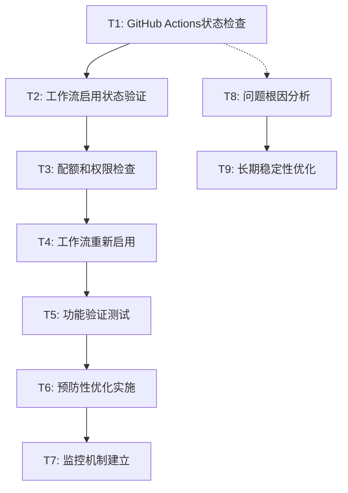

# ⚛️ GitHub Actions自动触发问题修复任务分解

## 📋 任务依赖关系图

## 🎯 原子任务定义

### T1: GitHub Actions状态检查
**目标**: 检查仓库Actions的基本状态和配置

#### 输入契约
- 仓库访问权限
- GitHub网页访问
- 当前工作流配置文件

#### 输出契约
- Actions启用状态报告
- 工作流列表和状态
- 权限配置信息

#### 验收标准
- ✅ 确认Actions功能已启用
- ✅ 获取所有工作流状态列表
- ✅ 记录当前权限设置

#### 实现约束
- 手动操作：GitHub网页界面
- 记录：截图或文字记录
- 时间：5分钟内完成

---

### T2: 工作流启用状态验证
**目标**: 确认具体工作流的启用/禁用状态

#### 输入契约
- T1的Actions状态报告
- 工作流名称: "🔄 同步 Gist 节点文件"

#### 输出契约
- 工作流启用状态 (启用/禁用)
- 最后执行时间记录
- 禁用原因 (如果被禁用)

#### 验收标准
- ✅ 明确工作流当前状态
- ✅ 确认最后成功执行时间
- ✅ 识别禁用原因 (如适用)

#### 实现约束
- 操作位置：GitHub Actions页面
- 检查项：工作流状态、执行历史
- 记录：详细状态信息

---

### T3: 配额和权限检查
**目标**: 检查GitHub Actions使用配额和权限设置

#### 输入契约
- GitHub账户访问权限
- 仓库设置访问权限

#### 输出契约
- 当月Actions使用情况
- 剩余配额信息
- 权限设置详情

#### 验收标准
- ✅ 获取配额使用数据
- ✅ 确认权限设置正确
- ✅ 识别潜在限制问题

#### 实现约束
- 检查位置：Settings → Billing, Actions
- 记录内容：使用量、限制、权限
- 分析：是否接近或超过限制

---

### T4: 工作流重新启用
**目标**: 重新启用被禁用的工作流

#### 输入契约
- T2的工作流状态信息
- 仓库管理员权限

#### 输出契约
- 工作流启用操作结果
- 启用后的状态确认
- 操作时间记录

#### 验收标准
- ✅ 工作流状态变为"启用"
- ✅ 可以手动触发执行
- ✅ 下次自动触发时间确认

#### 实现约束
- 前提条件：工作流确实被禁用
- 操作方法：GitHub Actions界面
- 验证：立即手动触发测试

---

### T5: 功能验证测试
**目标**: 验证自动触发和手动触发功能都正常

#### 输入契约
- T4的启用操作结果
- 工作流配置文件

#### 输出契约
- 手动触发测试结果
- 自动触发等待计划
- 功能完整性确认

#### 验收标准
- ✅ 手动触发成功执行
- ✅ 工作流执行无错误
- ✅ 输出结果符合预期

#### 实现约束
- 测试方法：手动触发 + 等待自动触发
- 验证内容：执行成功、输出正确
- 时间窗口：至少等待一个30分钟周期

---

### T6: 预防性优化实施
**目标**: 添加错误处理和健康检查机制

#### 输入契约
- 当前工作流配置文件
- T5的功能验证结果

#### 输出契约
- 优化后的工作流配置
- 健康检查机制
- 错误处理逻辑

#### 验收标准
- ✅ 添加健康检查步骤
- ✅ 实施错误处理机制
- ✅ 工作流执行更稳定

#### 实现约束
- 修改文件：.github/workflows/sync-gist.yml
- 添加内容：健康检查、错误处理
- 测试：确保修改后正常运行

---

### T7: 监控机制建立
**目标**: 建立自动触发状态的监控机制

#### 输入契约
- 优化后的工作流
- Git提交历史访问

#### 输出契约
- 监控脚本或机制
- 状态检查方法
- 告警通知设置

#### 验收标准
- ✅ 能够检测自动触发异常
- ✅ 提供状态监控信息
- ✅ 异常时有通知机制

#### 实现约束
- 实现方式：脚本或GitHub Actions
- 检查频率：每小时或每日
- 通知方式：日志或邮件

---

### T8: 问题根因分析 (并行任务)
**目标**: 深入分析导致自动触发停止的根本原因

#### 输入契约
- GitHub Actions执行历史
- 系统日志和错误信息

#### 输出契约
- 根因分析报告
- 问题发生时间线
- 预防措施建议

#### 验收标准
- ✅ 确定具体失败原因
- ✅ 分析问题发生模式
- ✅ 提出预防建议

#### 实现约束
- 分析范围：最近7天的执行记录
- 关注点：失败、超时、权限错误
- 输出：详细分析文档

---

### T9: 长期稳定性优化
**目标**: 实施长期稳定运行的优化措施

#### 输入契约
- T8的根因分析结果
- 当前系统运行状况

#### 输出契约
- 长期优化方案
- 稳定性改进措施
- 维护计划

#### 验收标准
- ✅ 降低失败概率
- ✅ 提高系统稳定性
- ✅ 建立维护流程

#### 实现约束
- 优化范围：工作流配置、执行频率
- 改进方向：稳定性、可靠性
- 维护：定期检查和更新

## 📅 执行计划

### 第一阶段：立即修复 (高优先级)
**执行顺序**: T1 → T2 → T3 → T4 → T5
**预计时间**: 30-60分钟
**目标**: 恢复自动触发功能

### 第二阶段：优化改进 (中优先级)
**执行顺序**: T6 → T7
**预计时间**: 1-2小时
**目标**: 提高稳定性和监控能力

### 第三阶段：深度分析 (中优先级)
**执行顺序**: T8 → T9
**预计时间**: 2-4小时
**目标**: 根本性解决和长期优化

## 🎯 成功指标

### 立即成功指标
- [ ] 工作流重新启用
- [ ] 手动触发正常
- [ ] 自动触发恢复

### 短期成功指标
- [ ] 连续24小时稳定运行
- [ ] 无自动触发中断
- [ ] 错误处理机制生效

### 长期成功指标
- [ ] 连续7天无故障
- [ ] 监控机制有效
- [ ] 预防措施到位

---

**任务设计人**: AI助手  
**设计时间**: 2024年执行  
**状态**: ⚛️ 任务分解完成，等待执行